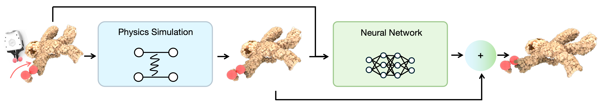

# Learning Physics-Guided Residual Dynamics for Deformable Object Simulation


<a href="shivanshpatel35.github.io">Shivansh Patel</a><sup>1</sup>, <a href="https://kywind.github.io/">Kaifeng Zhang</a><sup>2*</sup>, <a href="https://www.linkedin.com/in/sanjaypokkali/">Sanjay Pokkali</a><sup>1*</sup>, <a href="https://slazebni.cs.illinois.edu/">Svetlana Lazebnik</a><sup>1</sup>, <a href="https://yunzhuli.github.io/">Yunzhu Li</a><sup>2</sup><br>
<sup>1</sup>University of Illinois Urbana-Champaign, <sup>2</sup>Columbia University

[Website](http://pgrd-robot.github.io/) | [Paper](https://pgrd-robot.github.io/static/pdf/paper.pdf)

## Overview

This repository contains training and evaluation code for PGRD, a hybrid method that combines:
- An optimizable spring-mass physics backbone, and
- A learned residual dynamics network.



## Setup
1. Create and activate the environment:

```bash
conda env create -f environment.yml
conda activate pgrd
```

2. Install the local rasterization dependency:

```bash
cd third-party/diff-gaussian-rasterization-w-depth
pip install --no-build-isolation -e .
cd ../..
```

3. Verify installation:

```bash
python -c "import torch, dgl; print('torch', torch.__version__, 'dgl', dgl.__version__)"
```

## Dataset

Download the processed datasets from:
[Data (Google Drive)](https://drive.google.com/drive/folders/1d13M84pTzqCMqEOP2CaUh_eKT1FdIh7d?usp=sharing)

After downloading, place the extracted folders under `data/meta-material/data` (for example: `data/meta-material/data/rope_uiuc_merged`, `data/paper_uiuc_merged`, `data/rope_uiuc_merged`, `data/teddy_uiuc_merged`), so paths like `train.source_dataset_name=data/rope_uiuc_merged/sub_episodes_v` work directly with the provided scripts.

## CMA-ES Optimization (Required Before Training)

Before starting training, run CMA-ES to optimize simulation parameters for your object:

```bash
python cmaes_optim/cmaes_optim.py --name <object_name>
```

Example:

```bash
python cmaes_optim/cmaes_optim.py --name rope_uiuc
```

The best simulation parameters are saved under `cmaes_optim/outputs` (for example, `cmaes_optim/outputs/best_sim_params.json`). We mention the params used for subsequent objects in `experiments/cfg/sim_params/default.yaml`, which will be automatically picked up by the training and evaluation code.

## Training

Run training with:

```bash
bash train.sh
```

`train.sh` launches `experiments/train/train_eval.py` with the configured Hydra overrides.

## Evaluation

Download pretrained checkpoints from:
[Google Drive](https://drive.google.com/drive/folders/11pciw4liwh4J0cTV-lAInfpC72R7OsBO?usp=sharing)

Place checkpoints under the corresponding object directory used by `train.name`, then set `train.resume_iteration` to the checkpoint step you want to evaluate.

Run evaluation with:

```bash
bash eval.sh
```

`eval.sh` launches `experiments/train/eval.py` with the configured Hydra overrides.

## Custom Dataset

For custom data processing ideas and reference pipeline details, see the PGND repository:
[https://github.com/kywind/pgnd](https://github.com/kywind/pgnd)

## Acknowledgement

This codebase is built on top of the PGND codebase:
[https://github.com/kywind/pgnd](https://github.com/kywind/pgnd)
